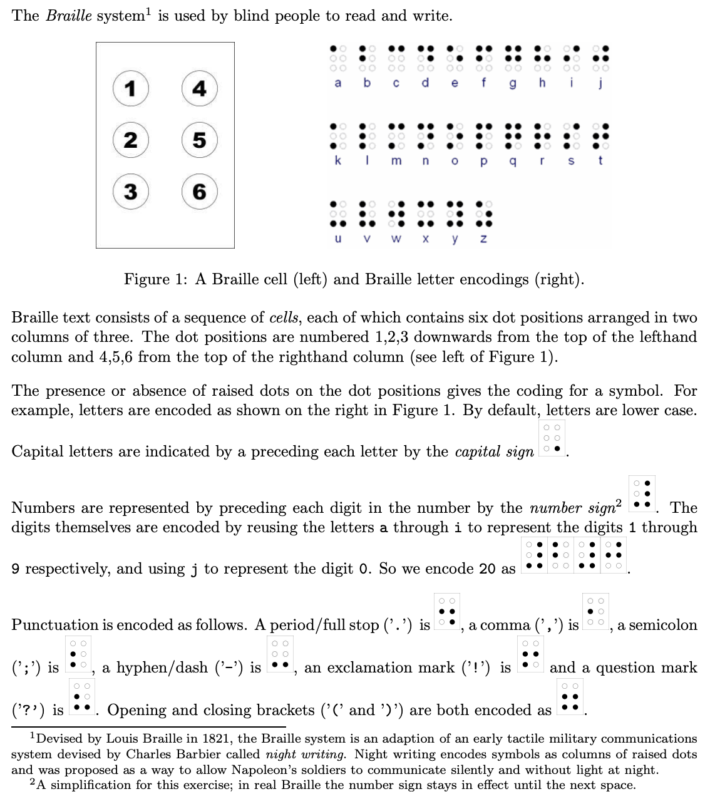

# Braille System

## Description

<p align="left">
  
</p>

## Objective

### 1
Write a function `encode_character(ch, braille)` which produces a string (the second parameter `braille`) that represents the Braille encoding of a single input character (the first parameter `ch`). In the string encoding, a Braille cell should be represented as 6 consecutive characters, one for each dot position; raised dots should be encoded as `'O'` and unraised dots as `'.'` For example, the character `n` should be encoded as the string `O.OOO.`. Any character for which the encoding has not been given (including the space character) should be encoded as `......`. The function should return the length of the Braille-encoded string.

For example, the code below should result in the string braille having the value `.OOOO.` and size having the value 6.
```
char braille[20];
int size;
size = encode_character('t', braille);
```

As another example, the code below should result in braille having the value `.....O¦O.O.OO` (i.e. the capital sign followed by the letter `z`) and size having the value 12.
```
char braille[20];
int size;
size = encode_character('Z', braille);
```

As a final example, the code below should result in braille having the value `..OOOO¦O...O.` (i.e. the number sign followed by the encoding for the letter `e`) and size having the value 12.
```
char braille[20];
int size;
size = encode_character('5', braille);
```

### 2
Write a recursive function `encode(plaintext, braille)` which produces the Braille encoding of a plaintext input string. The first parameter to the function (`plaintext`) is an input string containing the string to be encoded. The second parameter (`braille`) is an output parameter which should contain the corresponding Braille-encoded string.

For example, the code:
```
char braille[100];
encode("Hello!", braille);
```
should result in the string braille having the value:
`.....O¦OO..O.¦O...O.¦OOO...¦OOO...¦O.O.O.¦.OO.O.`

As in Question 1, the dashed vertical bars are included here only to aid understanding; they
should not be included in the output string.

### 3
Write a function `print_braille(plaintext, output)` which takes a plaintext string and writes the corresponding sequence of 3x2 Braille cells to an output stream. The function should also display the corresponding plaintext character under each Braille cell (where applicable). The first parameter (`braille`) is the input plaintext string and the second parameter is the output stream (e.g. `cout` or a file output stream).

For example, the code:
```
print_braille("Hello!", cout);
```
should result in the following output written to `cout` (i.e. displayed on the screen):
```
.. O. O. O. O. O. ..
.. OO .O O. O. .O OO
.O .. .. O. O. O. O.
   H  e  l  l  o  !
```