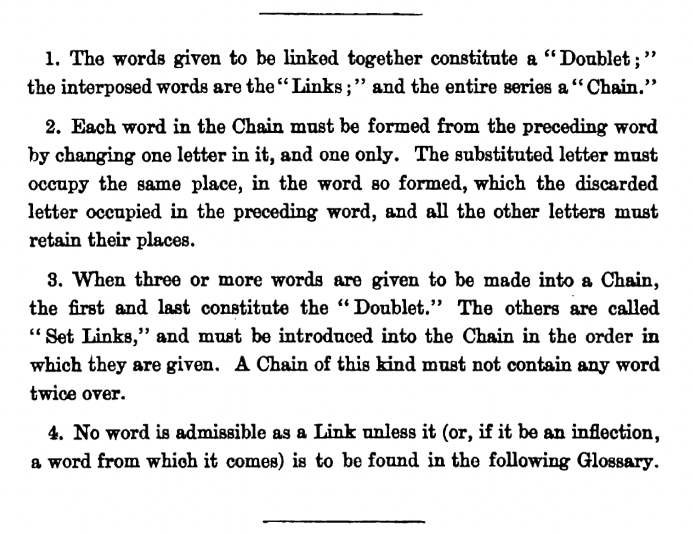

# Doublets

## Description
Doublets (also known as Word Ladders, Word-Links, Laddergrams and Word Golf) is a word game invented in the 1870s by Charles L. Dodgson, using the pen name Lewis Carroll.
The aim of Doublets is to form a chain of words which transforms a given start word into a given target word (which must be of the same length as the start word) in a number of steps. At each step, one (and only one) letter may be changed in the word from the previous step, provided that the new word so formed appears in an approved dictionary of English words (which Dodgson published as a glossary). Words that have already
appeared in previous steps are not permitted. The figure below shows pertinent extracts from the original rules.

<p align="center">
  
</p>

An example of a Doublet chain in which the start word `"WHEAT"` is transformed into the target word `"BREAD"` in seven steps is shown below. Note it is conventional when presenting a chain to display the start words and target words in uppercase while words in intermediate steps (the _links_) are displayed in lowercase.
```
WHEAT
cheat
cheap
cheep
creep
creed
breed
BREAD
```

Supplied files:
* `words.txt` - contains a dictionary of valid English words in uppercase
* `dictionary.h` - contains a `Dictionary` class

## Objective

### 1
Write a Boolean function `valid_step(current_word, next_word)` which returns `true` if the step from `current_word` to `next_word` represents a valid step in a Doublet chain according to Rule 2 and Rule 4 from the figure. You may assume that both words are supplied in uppercase format.
For example, the code:
```
bool valid = valid_step("WHEAT", "CHEAT");
cout << "From ’WHEAT’ to ’CHEAT’ is " << (valid ? "" : "NOT ")
<< "a valid step." << endl;
```
should display the output
```
From ’WHEAT’ to ’CHEAT’ is a valid step.
```
Similarly, the code:
```
bool valid = valid_step("WHEAT", "WHEAD");
cout << "From ’WHEAT’ to ’WHEAD’ is " << (valid ? "" : "NOT ")
<< "a valid step." << endl;
```
should display the output
```
From ’WHEAT’ to ’WHEAD’ is NOT a valid step.
```
This is because, although the words differ only in their final letters (obeying Rule 2), `'WHEAD'` does not appear in the dictionary of approved words (violating Rule 4).

### 2
Write a Boolean function `display_chain(chain, output_stream)` which writes a given chain to an output stream according to the conventions for the presentation of chains described in the problem description. The input parameter `chain` is a NULL-terminated array of uppercase C-style strings representing the words found at each step of the chain, while the input parameter `output_stream` can be any valid output stream, including `cout`. The function should return `true` if the entire `chain` was successfully written to the `output_stream`, and `false` otherwise.
For example, the code:
```
const char *wheat_chain[] = { "WHEAT", "CHEAT", "CHEAP", "CHEEP", "CREEP", "CREED", "BREED", "BREAD", NULL };
cout << "Displaying 7-step chain from ’WHEAT’ to ’BREAD’:" << endl;
bool success = display_chain(wheat_chain, cout);
cout << "Output " << (success ? "successful" : "failed") << "!" << endl;
```
should display the output
```
Displaying 7-step chain from ’WHEAT’ to ’BREAD’:
WHEAT
cheat
cheap
cheep
creep
creed
breed
BREAD
Output successful!
```

### 3
Write a Boolean function `valid_chain(chain)` which returns `true` if and only if the given chain is a valid Doublets chain according to all four rules. As before, the input parameter `chain` is a NULL-terminated array of uppercase C-style strings representing the words found at each step of the chain.
For example, the code:
```
const char *wheat_chain[] = { "WHEAT", "CHEAT", "CHEAP", "CHEEP",
"CREEP", "CREED", "BREED", "BREAD", NULL };
bool valid = valid_chain(wheat_chain);
cout << "The chain from ’WHEAT’ to ’BREAD’ is " << (valid ? "" : "NOT ")
<< "a valid chain." << endl;
```
should result in the output
```
The chain from ’WHEAT’ to ’BREAD’ is a valid chain.
```
Likewise, the code:
```
const char *repeat_chain[] = { "WHEAT", "CHEAP", "WHEAT", "CHEAP", NULL };
bool valid = valid_chain(repeat_chain);
cout << "The chain ’WHEAT->CHEAP->WHEAT->CHEAP’ is "
<< (valid ? "" : "NOT ") << "a valid chain." << endl;
```
should result in the output
```
The chain ’WHEAT->CHEAP->WHEAT->CHEAP’ is NOT a valid chain.
```

### 4
Write a recursive Boolean function `find_chain(start_word, target_word, answer_chain, max_steps)` which attempts to find a valid chain beginning with `start_word` and ending with `target_word` in up to `max_steps` steps. If a valid chain can be found, output parameter `answer_chain` should contain the found chain (in the form of a NULL-terminated array of uppercase C-style strings) and the function should return `true`. Otherwise the function should return `false`.
For example, the code:
```
const char *answer[100];
bool success = find_chain("HARD", "EASY", answer, 5);
cout << (success ? "Found" : "Could not find")
<< " a chain from ’HARD’ to ’EASY’ with up to 5 steps"<< endl;
if (success)
    display_chain(answer, cout);
```
should result in the following output (or another valid chain with different links):
```
Found a chain from ’HARD’ to ’EASY’ with up to 5 steps
HARD
bard
bare
base
ease
EASY
```