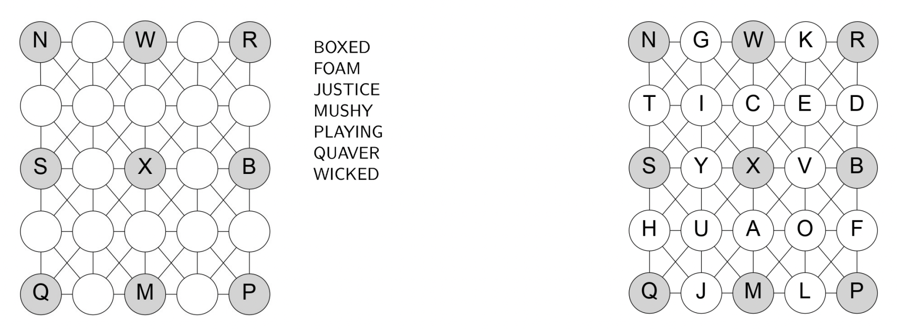

# Gogen Puzzle

## Description

<p align="center">
  
</p>

As shown on the left of the figure, a Gogen puzzle consists of a 5 × 5 board and a list of words. As shown on the right of the figure, the aim of Gogen is to insert the 25 letters 'A' to 'Y' ('Z' is not used) into the cells on the board such that...
* each letter appears in one (and only one) board cell
* by moving one step (horizontally, vertically or diagonally) at a time, it is possible to spell out each of the words
When solving Gogen puzzles, it helps to keep track of the possible board cell locations for each letter using an array of Boolean values known as a mask. In the above, the initial masks for the letter 'X' (said to be fixed because it has only one possible location), the letter 'E' (said to be free because it has more than one possible location) and the letter 'R' (also fixed) are, respectively (`0=false`, `1=true`):
```
// X
00000
00000
00100
00000
00000

// E
01010
11111
01010
11111
01010

// R
00001
00000
00000
00000
00000
```

The d-neighbourhood of a mask describes the set of board cells that are up to `d` cells away from those cells marked in the mask. For example, the 1-neighbourhoods of 'X', 'E' and 'R' are, respectively:
```
// X
00000
01110
01110
01110
00000

// E
11111
11111
11111
11111
11111

// R
00011
00011
00000
00000
00000
```

Because 'X' and 'E' appear consecutively in the word BOXED, we know 'E' appears in the 1-neighbourhood of 'X'; likewise, because 'E' and 'R' appear consecutively in the word QUAVER, we know 'E' appears in the 1-neighbourhood of 'R'. Thus, by intersecting (and-ing) the mask for 'E', the mask for the 1-neighbourhood
of 'X' and the mask for the 1-neighbourhood of 'R', we can compute an updated mask for 'E' as:
```
00000
00010
00000
00000
00000
```

With only one possible location, 'E' now becomes fixed. Proceeding in this manner, it is possible to narrow down the possible locations for each letter. If a point is reached where all letters are fixed, the puzzle is solved. If some letters remain stubbornly free, it becomes necessary to recursively investigate the remaining options.

Supplied files representing the game from the figure:
* `board-easy.txt`, `board-medium.txt` and `board-hard.txt` contain the initial boards for Gogen puzzles of easy, medium and hard difficulties respectively
* `words-easy.txt`, `words-medium.txt`, and `words-hard.txt` contain the corresponding word list for each puzzle. Each word appears on a separate line
* `solution-easy.txt` contains a valid solution to the easy Gogen puzzle, while `solution-wrong1.txt` and `solution-wrong2.txt` contain invalid solutions to the easy Gogen puzzle
* `common.h` - simply defines two constants `HEIGHT` and `WIDTH`, both as 5
* `mask.h` which contains the definition of a `Mask` class

## Objective

### 1
Write a Boolean function `get_position(board, ch, row, column)` which searches for the first occurrence of character `ch` in a given board when searched in a row-by-row fashion. If the character is found, the function should return `true` and set the output parameters `row` and `column` to the row and column number (indexed starting from 0). If the character cannot be found, the function should return `false` and `row` and `column` should both be set to `-1`.
For example, given the board shown on the left in the figure, the code:
```
char **board = load_board("board-easy.txt");
int row, column;
if (get_position(board, ’B’, row, column))
cout << "’B’ found in row " << row << ", column " << column << endl;
else
cout << "’B’ could not be found" << endl;
```
should display the output:
```
’B’ found in row 2, column 4
```
Similarly, the code:
```
if (get_position(board, ’O’, row, column))
cout << "’O’ found in row " << row << ", column " << column << endl;
else
cout << "’O’ could not be found" << endl;
```
should display the output:
```
’O’ could not be found
```

### 2
Write a Boolean function `valid_solution(board, words)` which returns `true` if the given `board` represents a solution to the Gogen puzzle with the given list of `words`.
For example, given the words in `words-easy.txt`, and a file `solution-easy.txt` containing the following
lines:
```
NGWKR
TICED
SYXVB
HUAOF
QJMLP
```
Then the code:
```
char **solution = load_board("solution-easy.txt");
char **words = load_words("words-easy.txt");
cout << "Solution in ’solution-easy.txt’ is "
<< (valid_solution(solution, words) ? "valid" : "invalid")
<< "!" << endl;
```
should display the output:
```
Solution in ’solution-easy.txt’ is valid!
```

### 3
#### Part I
Write a (void) function `update(board, ch, mask)` which mutually updates the `board` and a `mask` for letter `ch` according to the following rules:
* If `ch` is found in the `board` at position (r, c), then set every entry in `mask` to be `false` with the exception of element (r, c), which should be set to `true`, and return from the function
* For every cell in the `board` that is marked with a letter (that is not `ch`), set the corresponding element in `mask` to `false`
* If there is one (and only one) cell with the value `true` in `mask` then set the corresponding cell in the `board` to `ch`

For example, given the board shown on the left in the figure, the code:
```
Mask x; // by default all bits set to all true
update(board, ’X’, x);
cout << "Mask for ’X’" << endl;
x.print();
```
should result in the output:
```
Mask for ’X’
00000
00000
00100
00000
00000
```

Likewise, given the same `board`, the code:
```
Mask e; // by default all bits set to all true
update(board, ’E’, e);
cout << "Mask for ’E’" << endl;
e.print();
```
should result in the output:
```
Mask for ’E’
01010
11111
01010
11111
01010
```

#### Part II
Write a (void) function `neighbourhood_intersect(one, two)` which modifies masks `one` and `two` by intersecting each with the 1-neighbourhood of the other.
For example, the code:
```
Mask x, e;
update(board, ’X’, x);
update(board, ’E’, e);
neighbourhood_intersect(x, e); // from BOXED
cout << "After neighbourhood intersection, mask for ’E’ is " << endl;
e.print();
```
should result in the output:
```
After neighbourhood intersection, mask for ’E’ is
00000
01110
01010
01110
00000
```

### 4
Write a Boolean function `solve_board(board, words)` which attempts to find a solution to a given Gogen puzzle. If a solution can be found, parameter `board` should contain the completed board. Otherwise the function should return `false`. A high-level overview of one possible approach is:
* Create an array of 25 masks (one for each letter ’A’ to ’Y’) and use the `update()` function to
initialise them
* Then repeatedly use the adjacent letters appearing in each word with the `neighbourhood_intersect()` and `update()` functions to refine the masks of free letters as much as possible
* Finally, if it necessary, recursively investigate the remaining options for the free letters. This should not be necessary with the “easy” puzzle, but will be needed for the “medium” and “hard” puzzles.

For example, the code:
```
char **board = load_board("board-easy.txt");
char **words = load_words("words-easy.txt");
if (solve_board(board, words)) {
cout << "Board solved! Solution: " << endl;
print_board(board);
save_board(board, solution_filename);
} else
cout << "Board could not be solved" << endl;
```
should result in the following output:
```
Board solved! Solution:
[N]--[G]--[W]--[K]--[R]
| \/ | \/ | \/ | \/ |
| /\ | /\ | /\ | /\ |
[T]--[I]--[C]--[E]--[D]
| \/ | \/ | \/ | \/ |
| /\ | /\ | /\ | /\ |
[S]--[Y]--[X]--[V]--[B]
| \/ | \/ | \/ | \/ |
| /\ | /\ | /\ | /\ |
[H]--[U]--[A]--[O]--[F]
| \/ | \/ | \/ | \/ |
| /\ | /\ | /\ | /\ |
[Q]--[J]--[M]--[L]--[P]
```

## Mask Class Usage

### Creating a mask
You are supplied with a `Mask` class in `mask.h`. To create a `Mask`, simply declare:
```
Mask m;
```
This will create a mask with all entries set to `true`:
```
11111
11111
11111
11111
11111
```
If you wish to create a mask with all entries set to `false`, use:
```
Mask m(false);
```

### Modifying the elements in a mask
One way to set all the entries in a mask is to use the `set_all()` method, e.g.:
```
Mask m;
m.set_all(false);
```

Individual elements of masks may be modified or retrieved using the `set_element()` and `get_element()` methods respectively, e.g.
```
Mask m(false);
m.set_element(2,2);
```
results in m having value:
```
00000
00000
00100
00000
00000
```

You can also use square brackets to access the elements in the mask, as if `Mask` were simply a two dimensional array, e.g.
```
Mask m(false);
m[2][2] = true;
if (m[0][0]) {
...
}
```

### Printing masks
You can use the `print()` method to print a mask using `0` for `false` and `1` for `true`, e.g.
```
Mask m(false);
m[2][2] = true;
m.print();
```
will output:
```
00000
00000
00100
00000
00000
```

### Finding the d-neighbourhood of a mask
The `neighbourhood(int d)` method returns the d-neighbourhood of a mask. By default `d = 1`. Thus the code:
```
Mask m(false);
m[2][2] = true;
Mask nbr = m.neighbourhood();
nbr.print();
```
will output:
```
00000
01110
01110
01110
00000
```

### Counting the number of bits set to true in a mask
The `count()` method returns the number of bits set to `true` in a given mask. Thus:
```
Mask m(false);
m[2][2] = true;
Mask nbr = m.neighbourhood();
cout << nbr.count() << endl;
```
will output:
```
9
```

### Finding the first bit with a particular value in a mask
The `get_position(bool value, int &row, int &col)` method scans a mask in a row-wise fashion looking for the first mask element having a given value (`true` or `false`). If such an element is found, `row` and `col` are
set to the row and column of the found element respectively, and the method returns `true`. Otherwise the method returns `false` and `row` and `col` are both set to `-1`.
Thus the code:
```
Mask m(false);
m[3][4] = true;
int r,c;
m.get_position(true, r, c)
```
results in `r` having the value `3` and `c` the value `4`.

### Intersection and union operations on masks
Masks may be intersected in an elementwise fashion in number of different ways. One way is to use the `intersect_with()` method:
```
Mask one, two; // all values true by default
one[2][2] = false;
two[3][4] = false;
two[3][0] = false;
one.intersect_with(two);
```
results in one having the value:
```
11111
11111
11011
01110
11111
```

The `*` and `*=` operators have also been overridden to denote intersection operations, so: `one *= two` or
`one = one * two` will have the same effect.

Likewise `union_with()` will perform an elementwise union, for which the `+` and `+=` operators have also
been overridden.

### Flipping all bits in a mask
The not (`!`) operator has been overridden to return a mask with all bits flipped. Thus:
```
Mask m(false);
m[2][2] = true;
(!m).print();
```
outputs:
```
11111
11111
11011
11111
11111
```