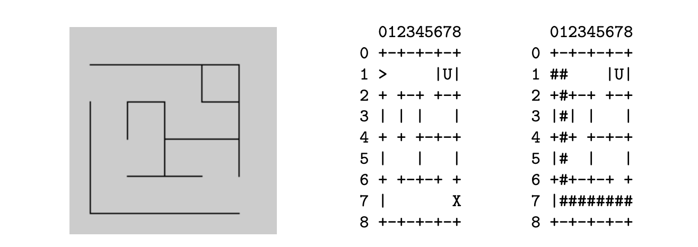

# Maze

## Description

A hedge maze is an outdoor maze or labyrinth in which the “walls” between passages are made of vertical hedges. Hedge mazes were a popular form of amusement for British and European royalty and aristocrats in the 17th and 18th centuries.

As seen in the figure below, we will represent a maze as a rectangular two-dimensional array of characters, using the "barrier" characters `-`, `+` and `|` for hedges and (unique) "marker" characters to denote points of interest. Here `>` represents the entrance, `X` the exit, and `U` an unreachable square.

<p align="center">
  
</p>

A solution path through the maze is a sequence of directions from one marker character to another using the letters N, S, E and W for north, south, east and west respectively. The path must not pass through any hedges or pass outside the boundaries of the maze. Hence a valid solution path for the example maze from the entrance to the exit (shown on the right in the figure) is `ESSSSSSEEEEEEE`. Although it leads from the entrance to the exit, the path `EEEEEEEESSSSSS` is not a valid solution path since it passes through hedges.

## Objective

### 1
Write a function `find_marker(ch, maze, height, width, row, column)` which finds the coordinates of marker character `ch` in the 2D array of characters `maze` of dimension `height` × `width`. `row` and `column` are output parameters. When the maze contains the marker character, `row` and `column` should be set to the row and column coordinates of the marker character respectively, and the function should return `true`. If the `maze` does not contain the marker character `row` and `column` should both be set to `-1`, and the function should return `false`.
For example, using the simple maze as that shown in the figure, the code below should result in `row` having the value `7`, `column` having the value `8`, and `success` having the value `true`.
```
int height, width, row, column;
char **maze = load_maze("simple.txt", height, width);
bool success = find_marker(’X’, maze, height, width, row, column);
```

### 2
Write a function `valid_solution(path, maze, height, width)` which determines if a given path through a `height` × `width` maze leads from the entrance marker `>` to the exit marker `X` without moving outside the boundaries of the maze or passing through a hedge. The parameter `path` is a string of uppercase characters, each of which is in the set `{'N','S','E','W'}` (corresponding to North, South, East and West respectively).
For example, using the simple maze from the figure, the code below:
```
cout << "The move sequence ’ESSSSSSEEEEEEE’ is ";
if (!valid_solution("ESSSSSSEEEEEEE", maze, height, width))
cout << "NOT ";
cout << "a solution to the maze" << endl << endl;
```
should result in the output:
```
The move sequence ’ESSSSSSEEEEEEE’ is a solution to the maze.
```

### 3
Write a function `find_path(maze, height, width, start, end)` which finds a valid solution path through a `height` × `width` maze beginning at marker character `start` and terminating at marker character `end`. The path should be marked on the maze using `#` characters, and the function should return a string of direction movements. If there is no path, the function should return the string `"no solution"`.
For example, using the simple maze from the figure, the code:
```
cout << "A path through the maze from ’>’ to ’X’ is: ";
path = find_path(maze, height, width, ’>’, ’X’);
cout << path << endl;
print_maze(maze, height, width);
```
should result in the output:
```
A path through the maze from ’>’ to ’X’ is:
ESSSSSSEEEEEEE

  012345678
0 +-+-+-+-+
1 ## |U|
2 +#+-+ +-+
3 |#| | |
4 +#+ +-+-+
5 |# | |
6 +#+-+-+ +
7 |########
8 +-+-+-+-+
```