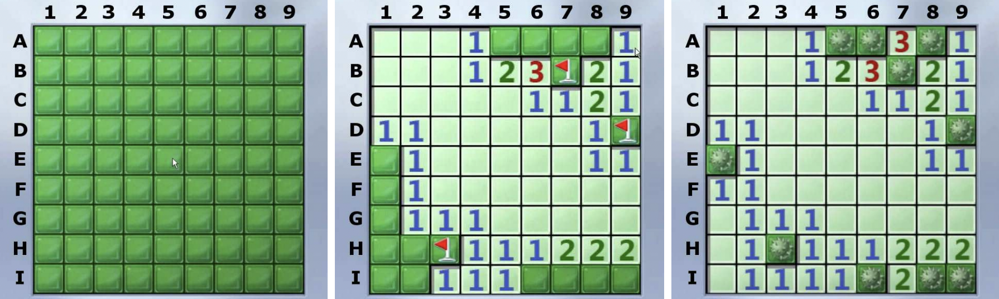

# Minesweeper

## Description

Minesweeper is a single-player game played on a rectangular grid (here assumed to be 9 × 9). The player is initially presented with a grid of covered squares. Some of the covered squares conceal mines, and it is the player’s goal to work out exactly where they are without exploding any of them.

<p align="center">
  
</p>

At each turn, the player must chose to either _uncover_ a square or to _flag_ a square as containing a mine. If a player uncovers a square containing a mine, the mine explodes and the player loses the game. Otherwise a digit is displayed in the uncovered square which indicates how many adjacent (neighbouring) squares contain mines. If there are no adjacent mines, the square becomes blank and all adjacent squares are recursively uncovered. If all mine-free squares become uncovered, the player wins the game (as shown on the right in the figure).

A player can use the digits displayed on squares to deduce that one or more squares definitely contains a mine (and should be flagged). For example, in the middle panel of the figure, it can be deduced that squares A5 and A6 contain mines since otherwise B5 would not have the value 2. Equally, a player may deduce that it is safe to uncover one or more squares. For example, because H3 is flagged and G2 has the value 1, it must be safe to uncover F1, G1, H1 and H2.

Supplied files representing the game from the figure:
* `mines.dat` - data file representing the locations of mines
* `partial.dat` - partially complete playing board
* `solution.dat` - solved playing board

## Objective

### 1
Write a Boolean function `is_complete(mines, revealed)` which takes two 9×9 arrays of characters, the first (`mines`) representing mine locations and the second (`revealed`) the current playing board, and returns `true` if and only if all non-mine squares in the playing board have been uncovered.
For example, the code:
```
load_board("mines.dat", mines);
load_board("solution.dat", revealed);
cout << "Game is ";
if (!is_complete(mines, revealed))
cout << "NOT ";
cout << "complete." << endl;
```
should display the output
```
Loading board from file ’mines.dat’... Success!
Loading board from file ’solution.dat’... Success!
Game is complete.
```

### 2
Write a function `count_mines(position, mines)` which returns the number of mines around a particular square. Here position is a two-character string denoting row and column board coordinates (e.g. `"I8"`) and `mines` is a 2D character array of mine locations.
For example, the code:
```
load_board("mines.dat", mines);
cout << "Found " << count_mines("A7", mines)
<< " mine(s) around square ’A7’" << endl;
cout << "Found " << count_mines("E5", mines)
<< " mine(s) around square ’E5’" << endl;
cout << "Found " << count_mines("H9", mines)
<< " mine(s) around square ’H9’" << endl;
```
should display the output
```
Loading board from file ’mines.dat’... Success!
Found 3 mine(s) around square ’A7’
Found 0 mine(s) around square ’E5’
Found 2 mine(s) around square ’H9’
```

### 3
Write a function `make_move(position, mines, revealed)` which uncovers or flags a square. Here `mines` is an input parameter representing mine locations while `revealed` is an input/output parameter presenting the current playing board. The first two characters of `position` denote the row and column board coordinates. If no other characters are present in `position`, the move is to _uncover_ the square in `revealed`. If a `’*’` is present as the third character, the move is to _flag_ the square in `revealed`. The return value should be of type `MoveResult` (see `minesweeper.h`).
`INVALID_MOVE` is returned when the row and column coordinates are not valid or if the third character is present, but is not a `’*’`.
`REDUNDANT_MOVE` is returned if the target position corresponds to a square that has already been uncovered or flagged.
`BLOWN_UP` is returned if the move uncovers a mine.
`SOLVED_BOARD` is returned if all non-mine squares in `revealed` have been uncovered.
Otherwise, `VALID_MOVE` is returned.

For example, the calls:
```
load_board("mines.dat", mines);
initialise_board(revealed);
MoveResult result1 = make_move("B6", mines, revealed);
MoveResult result2 = make_move("E5", mines, revealed);
MoveResult result3 = make_move("H3*", mines, revealed);
```
should result in `revealed` successively taking on the values:
```
  123456789
 +---------+
A|?????????|
B|?????3???|
C|?????????|
D|?????????|
E|?????????|
F|?????????|
G|?????????|
H|?????????|
I|?????????|
 +---------+

  123456789
 +---------+
A|   1?????|
B|   123???|
C|     112?|
D|11     1?|
E|?1     11|
F|?1       |
G|?111     |
H|???111222|
I|?????????|
 +---------+

  123456789
 +---------+
A|   1?????|
B|   123???|
C|     112?|
D|11     1?|
E|?1     11|
F|?1       |
G|?111     |
H|??*111222|
I|?????????|
 +---------+
```
with `result1`, `result2` and `result3` all set to `VALID_MOVE`.

### 4
Write Boolean function `find_safe_move(revealed, move)` which determines if a risk-free move (an uncover or flag move which can be safely made without any guesswork) is available starting from the current playing board `revealed`. The return value of the function should be `true` if a risk-free move is available, in which case output string `move` should contain the move. Otherwise the return value of the function should be `false` and the output string `move` should be the empty string.
For example, the code:
```
load_board("mines.dat", mines);
load_board("partial.dat", revealed);
display_board(revealed);
cout << "Safe move sequence: " << endl;
char move[512];
while (find_safe_move(revealed, move)) {
cout << move << " ";
make_move(move, mines, revealed);
}
cout << endl;
```
should result in output similar to:
```
Loading board from file ’partial.dat’... Success!
  123456789
 +---------+
A|   1????1|
B|   123*21|
C|     1121|
D|11     1*|
E|?1     11|
F|?1       |
G|?111     |
H|??*111222|
I|??111????|
 +---------+

Safe move sequence:
A5* A8* A6* A7 E1* F1 G1 I6* I7 I8* I9*
```