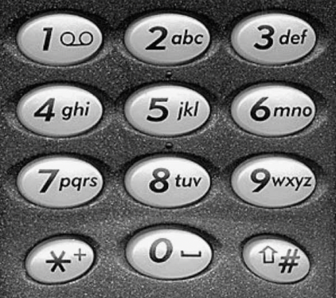

# Multitap

## Description
Multitap is a method of text entry using a mobile phone keypad. As shown in the figure below, a typical keypad consists of the number keys `0–9` and two additional keys (`*` and `#`). The letters `a–z` are spread over the keys `2–9` in alphabetic order, and the space character (`' '`) is assigned to the `0` key.

<p align="left">
  
</p>

With multitap, a user presses each key one or more times to specify a desired letter. For example, the 6 key is pressed once for the letter m, twice for the letter n and three times for the letter o. Thus the word `imperial` is encoded as `44467337774442555` in multitap.

Letter case is controlled using the # key, which toggles (i.e. switches) between upper case and lower case input modes; initially input begins in lower case mode. Thus `FOx` is encoded as `#333666#99`.

Note that, in order to avoid ambiguity, users may have to pause between consecutive letters (of the same case) that are encoded using the same key. For example, the word `cab` involves repeated presses of the 2 key. If we use a `'|'` character to indicate a pause, then `cab` is encoded in multitap as `222|2|22`.

Punctuation marks are entered by repeated presses of the `1` key. In particular, you may assume that `'.'` (full stop), `','` (comma), `'!'` (exclamation mark) and `'?'` (question mark) are encoded on the `1` key (in that order).

Digits are entered by pressing the `*` key and then the corresponding number key. So `15` is encoded as `*1*5`.

## Objective

### 1
Write a function `encode_character(ch, multitap)` which produces the multitap encoding of a single input character (ignoring case) and which also returns the number of keystrokes required to encode the input character. The first parameter to the function (`ch`) is the character to be encoded. The second parameter (`multitap`) is an output parameter that should contain the multitap-encoded string corresponding to the character. The return value of the function is the length of the multitap encoding.

For example, the code:
```
char multitap[20];
int size;
size = encode_character(’c’, multitap);
```
should result in the string `multitap` having the value `"222"` and `size` having the value `3`.

As another example, the code:
```
char multitap[20];
int size;
size = encode_character(’5’, multitap);
```
should result in the string `multitap` having the value `"*5"` and size having the value `2`.

### 2
Write a function `encode(plaintext, multitap)` which produces the multitap encoding of a plaintext input string. The first parameter to the function (`plaintext`) is an input string containing the string to be encoded. The second parameter (`multitap`) is an output parameter which should contain the corresponding multitap-encoded string (taking letter case and pauses into account).

For example, the code:
```
char multitap[100];
encode("Meet Anna at 5pm", multitap);
```
should result in the string `multitap` having the value: `"#6#33|3380#2#66|6620280*576"`

### 3
Write a function `decode(input, output)` which takes a multitapencoded input stream and writes a decoded plaintext version to an output stream. The first parameter (`input`) is the input stream (e.g. `cin` or a file input stream) and the second parameter is the output stream (e.g. cout or a file output stream).

For example, given an input file called `message.txt` that contains the text:
```
#222#666|66477728|8855528444666|667777111
```
then the code:
```
ifstream input;
input.open("message.txt");
decode(input, cout);
input.close();
```
should result in the following output written to `cout` (i.e. displayed on the screen):
```
Congratulations!
```