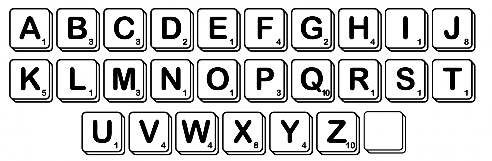
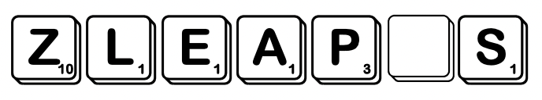

# Scrabblegram

## Description

<p align="center">
  
</p>

Scrabblegram is a quick-play variant of the world-famous Scrabble word game. The aim of the game is to form a high-scoring English word from a collection of **seven** tiles, each of which represents a letter of the alphabet (see figure above). Each tile is annotated with a numerical tile score according to the letter it represents. There is also a special _blank_ tile which can represent any letter, but which has a tile score of zero.
When forming a word, each of the seven tiles in a collection may be used only once. For example, given the tiles:
<p align="center">
  
</p>

Words that can be formed include `LEAP`, `LEAPS`, `PLEASE`, `APPLES`, `WASP` and `SPATZLE`. It is not possible, however, to make the word `PIZZA` from this collection of tiles.

The word score for a formed word is computed taking into account the tile score for each of the tiles used and
score modifiers specified for each position of the formed word. Possible score modifiers are:
* **None** - the contribution of the tile towards the word score is the tile score.
* **Double letter score** - the contribution of the tile towards the word score is twice the tile score.
* **Triple letter score** - the contribution of the tile towards the word score is three times the tile score.
* **Double word score** - the contribution of the tile towards the word score is the tile score. However, the total number of points should be doubled once the final score modifier has been applied.
* **Triple word score** - the contribution of the tile towards the word score is the tile score. However, the total number of points should be tripled once the final score modifier has been applied.

A bonus of 50 points is added to the word score if all seven tiles are used to make up the word.

For example, given the tiles above and the score modifiers:
```
{None, Triple Letter Score, None, None, Double Word Score, None, None}
```
* `LEAP` scores `8 (1+3*1+1+3)` points (since the word is not long enough to reach the Double Word
Score score modifier)
* `WASP` scores `7 (0+3*1+1+3)` points (since blank tiles score 0)
* `PLEASE` scores `18 ((3+3*1+1+1+1+0)*2)` points
* `SPATZLE` scores `96 ((1+3*3+1+0+10+1+1)*2+50)` points

Supplied files:
* `words.txt` - containing a dictionary of English words in uppercase

## Objective

### 1
Write an integer-valued function `tile_score(tile)` which returns the tile score for a given tile. Here `tile` is an input parameter of character type. If `tile` is a letter (whether uppercase or lowercase) then the function should return the tile score for that letter. If tile is `' '` or `'?'` (both of which can be used to represent the blank tile), the function should return `0`. Otherwise the function should return `-1`. 

For example, the code:
```
cout << "Tile score for 'P' is " << tile_score('P') << endl;
```
should display the output
```
Tile score for 'P' is 3
```

Similarly, the code:
```
cout << "Tile score for '1' is " << tile_score('1') << endl;
```
should display the output
```
Tile score for '1' is -1
```

### 2
Write a recursive Boolean function `can_form_word_from_tiles(word, tiles, played_tiles)` which determines whether a given `word` can be made from a given collection of `tiles`. Here `word` is an input parameter of `string` type describing the target word while `tiles` is an input parameter of `string` type describing the tiles in the collection. You may assume that the target word is a valid English word. If the target word can be formed from the tiles according to the rules described in the Description section, the function should return `true`, and output parameter `played_tiles` should be a null-terminated string consisting of the ordered collection of tiles used. Otherwise the function should return `false`.

For example, the code:
```
char played_tiles[80];
bool success = can_form_word_from_tiles("LEAP", "ZLEAP?S", played_tiles);
```
should result in `success` having the value `true` and `played_tiles` having value `LEAP`.

Likewise the code:
```
char played_tiles[80];
bool success = can_form_word_from_tiles("APPLES", "ZLEAP?S", played_tiles);
```
should result in `success` having the value `true` and `played_tiles` having value `AP?LES`.

As a final example, the code:
```
char played_tiles[80];
bool success = can_form_word_from_tiles("PIZZA", "ZLEAP?S", played_tiles);
```
should result in `success` having the value `false`.

### 3
Write an integer-valued function `compute_score(played_tiles, score_modifiers)` which returns the word score given a `played_tiles` string and an array of `score_modifiers`. The individual elements in the `score_modifiers` array are of enumerated type `ScoreModifier`.

For example, the code:
```
ScoreModifier sm0[]={NONE, TRIPLE_LETTER_SCORE, NONE, NONE, DOUBLE_WORD_SCORE, NONE, NONE};
int score = compute_score("LEAP", sm0);
```
should result in `score` having the value `8`.

Likewise, the code:
```
score = compute_score("AP?LES", sm0);
```
should result in `score` having the value `26`.

As a final example, the code:
```
score = compute_score("SPA?ZLE", sm0);
```
should result in `score` having the value `96`.

### 4
Write an integer-valued function `highest_scoring_word_from_tiles(tiles, score_modifiers, word)` which returns the highest word score that can be achieved given a particular collection of `tiles` and score
modifiers, using any of the words in the supplied dictionary. Here `tiles` and `score_modifiers` are input parameters of type `string` and `ScoreModifier[]` respectively.
If it not possible to make any word in the supplied dictionary from the tiles then the function should return `-1`. Otherwise output parameter `word` should contain the word attaining the highest word score, and the function should return the achieved word score.

For example, the code:
```
ScoreModifier sm1[]={NONE, NONE, DOUBLE_LETTER_SCORE, NONE, NONE, NONE, NONE};
char word[512];
score = highest_scoring_word_from_tiles("WBNNOER", sm1, word);
cout << "The highest scoring word that can be made from the tiles 'WBNNOER'" << endl;
cout << " with a double letter score on the third letter is:" << endl;
if (score < 0)
  cout << "(no word found)" << endl;
else
  cout << "'" << word << "' (" << score << " points)" << endl;
```
should result in the following output:
```
The highest scoring word that can be made from the tiles 'WBNNOER'
with a double letter score on the third letter is:
'NEWBORN' (66 points)
```