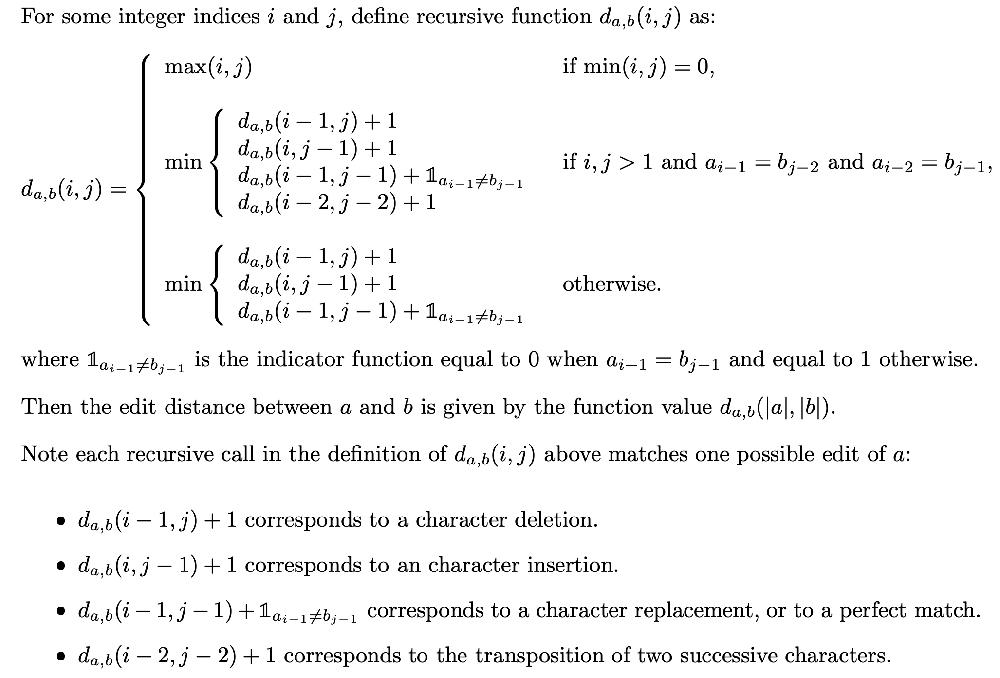

# Spell Checker

## Description
Spell checking is the process of flagging words in a document that may not be spelled correctly – vital functionality that is taken for granted by most users of modern PCs.

A spell checker depends crucially on having a way to measure the degree of difference between the word someone actually typed and the word they were meaning to type – the so-called edit distance. More precisely, the edit distance between two strings `a` and `b` is defined as the number of character insertions, deletions, replacements and transpositions (swaps of adjacent characters) needed to transform `a` into `b`.

The edit distance between some string `a` (of length `|a|`, and made up of characters `a_0, a_1, . . . , a_|a|−1`) and some string `b` (of length `|b|`, and made up of characters `b_0, b_1, . . . , b_|b|−1`) can be computed with the help of the so-called **Damerau–Levenshtein distance** function as follows.

<p align="center">
  
</p>

A simple way for a spell checker to suggest corrected spellings for a single word is as follows:
Given a word `w`, and a dictionary of known words `D`...

* If `w` is in `D`, return `w`
* If there are one or more words in `D` at an edit distance of one from `w`, return the one that occurs most frequently in typical English text
* If there are one or more words in `D` at an edit distance of two from `w`, return the one that occurs most frequently in typical English text
* Otherwise, give up and return the original word, even though it is not known

Supplied files:
* `words.dat` - dictionary of English words and their corresponding frequencies (the number of times each word was observed in a corpus made up of several works of literature)

## Objective

### 1
Write an integer-valued function `frequency(target)` which takes as its parameter a target word and which returns the number of times the target word appears in the corpus (by looking this up in `words.dat`). If the word cannot be found then the function should return `0`.
For example, the code:
```
cout << "The frequency of the word ’a’ in the corpus is "
  << frequency("a") << endl;
```
should display the output
```
The frequency of the word ’a’ in the corpus is 20096
```
while the code:
```
cout << "The frequency of the word ’nonexistential’ in the corpus is "
  < frequency("nonexistential") << endl;
```
should display the output
```
The frequency of the word ’nonexistential’ in the corpus is 0
```

### 2
Write an integer-valued function `edit_distance(a, b)` which returns the edit distance between read-only input character strings `a` and `b`.
For example, the code:
```
cout << "The edit distance between ’an’ and ’na’ is "
  << edit_distance("an","na") << endl;
```
should display the output
```
The edit distance between ’an’ and ’na’ is 1
```
since "an" may be transformed into "na" by a single transposition of (adjacent) characters.

Likewise, the code:
```
cout << "The edit distance between ’korrectud’ and ’corrected’ is "
  << edit_distance("korrectud","corrected") << endl;
```
should display the output
```
The edit distance between ’korrectud’ and ’corrected’ is 2
```
Since the replacement of two characters ('k' and 'u') sufficies to transform the first word into the second.

### 3
Write a Boolean function `spell_correct(word, fixed)` which suggests a spell checked variant of a word. Here `word` is a read-only input parameter specifying the word to be spell checked, while `fixed` is an output parameter giving the suggested correction. The return value of the function should be `true` if `fixed` differs from `word` and `false` otherwise.
For example, the code:
```
bool corrected = spell_correct("korrectud", fixed);
cout << "The corrected spelling of ’korrectud’ is ’"<< fixed << "’" << endl;
cout << "The spell checker was " << (corrected ? "" : "NOT ")
  << "needed."<< endl;
```
should result in the output
```
The corrected spelling of ’korrectud’ is ’corrected’
The spell checker was needed.
```
with Boolean variable `corrected` set to `true`.

### Hints
You may find your first implementation of part 2 not quite efficient enough for you to obtain a solution to part 3 in reasonable time. You may be able to address this problem using up to two additional default parameters in your solution to part 2 to restrict the maximum edit distance explored.