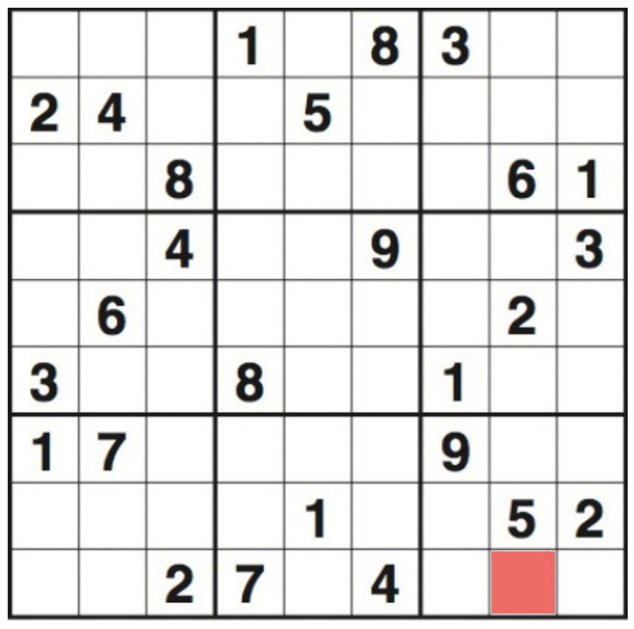

# Sudoku

## Description
Sudoku is a popular number-placement puzzle played on a 9 × 9 board. Starting with a partially completed board of the kind shown in the figure below, the objective is to fill the board with digits so that each row of the board, each column of the board and each of the nine 3 × 3 sub-boards contain all of the digits from 1 to 9.

<p align="center">
  
</p>

Ideally Sudoku problems have just one unique solution. Typically Sudoku players use logic to deduce what digit should be assigned to a particular board position. For example, one can readily work out that the highlighted square towards the bottom right of the figure must contain the digit 1. This is because the lower-right 3 × 3 sub-board must contain a 1 and there is a 1 in the 7th and 8th rows and in the 7th and 9th columns already.

Supplied files:
* `easy.dat` - "easy" Sudoku board
* `medium.dat` - "medium" difficulty Sudoku board
* `mystery1.dat`, `mystery2.dat` and `mystery3.dat` - "mystery" boards

## Objective

### 1
Write a Boolean function `is_complete(board)` which takes a 9 × 9 array of characters representing a Sudoku board and returns `true` if all board positions are occupied by digits, and `false` otherwise. Note you do not need to check whether each digit is logically valid.
For example, the code:
```
load_board("easy.dat", board);
cout << "Board is ";
if(!is_complete(board)) {
    cout << "NOT ";
}
cout << "complete." << ’\n’;
```
should display the output
```
Loading Sudoku board from file ’easy.dat’... Success!
Board is NOT complete.
```

Similarly, the code:
```
load_board("easy-solution.dat", board);
cout << "Board is ";
if(!is_complete(board)) {
    cout << "NOT ";
}
cout << "complete." << ’\n’;
```
should display the output
```
Loading Sudoku board from file ’easy-solution.dat’... Success!
Board is complete.
```

### 2
Write a Boolean function `make_move(position, digit, board)` which attempts to place a digit onto a Sudoku board at a given position. Here `position` is a two-character string denoting row (A to I) and column (1 to 9) board coordinates (e.g. "I8" ), `digit` is a character denoting the digit to be placed (from '1' to '9'), and `board` is a two-dimensional character array. If `position` is invalid (e.g. because the coordinates are out of range), or the placing of the `digit` at `position` is invalid (e.g. because it would result in two copies of the same `digit` in the same row), then the return value of the function should be `false`, and `board` should be unaltered. Otherwise, the return value of the function should be `true` and `board` should be updated to reflect the placing of `digit` at `position`.
For example, the code:
```
load_board("easy.dat", board);
cout << "Putting ’1’ into I8 is ";
if(!make_move("I8", ’1’, board)) {
    cout << "NOT ";
}
cout << "a valid move." << ’\n’;
```
should result in the output:
```
Loading Sudoku board from file ’easy.dat’... Success!
Putting ’1’ into I8 is a valid move.
```
and board cell I8 should be `'1'`.

### 3
Write a Boolean function `save_board(filename, board)` which outputs the two-dimensional character array board to a file with name `filename`. The return value should be `true` if the file was successfully written, and `false` otherwise.
For example, the code:
```
load_board("easy.dat", board);
if(save_board("easy-copy.dat", board)) {
    cout << "Save board to ’easy-copy.dat’ successful." << ’\n’;
} else {
    cout << "Save board failed." << ’\n’;
}
cout << ’\n’;
```
should result in the output:
```
Loading Sudoku board from file ’easy.dat’... Success!
Save board to ’easy-copy.dat’ successful.
```
with `easy-copy.dat` having identical contents to `easy.dat`.

### 4
Write a Boolean function `solve_board(board)` which attempts to solve the Sudoku puzzle in input/output parameter `board`. The return value of the function should be `true` if a solution is found, in which case `board` should contain the solution found. In the case that a solution does not exist the return value should be `false` and `board` should contain the original board.
For example, the code:
```
load_board("easy.dat", board);
if(solve_board(board)) {
    cout << "The ’easy’ board has a solution:" << ’\n’;
display_board(board);
} else {
    cout << "A solution cannot be found." << ’\n’;
}
```
should result in the output:
```
Loading Sudoku board from file 'easy.dat'... Success!
    1   2   3   4   5   6   7   8   9   
  +===========+===========+===========+
A |   :   :   | 1 :   : 8 | 3 :   :   |
  +---+---+---+---+---+---+---+---+---+
B | 2 : 4 :   |   : 5 :   |   :   :   |
  +---+---+---+---+---+---+---+---+---+
C |   :   : 8 |   :   :   |   : 6 : 1 |
  +===========+===========+===========+
D |   :   : 4 |   :   : 9 |   :   : 3 |
  +---+---+---+---+---+---+---+---+---+
E |   : 6 :   |   :   :   |   : 2 :   |
  +---+---+---+---+---+---+---+---+---+
F | 3 :   :   | 8 :   :   | 1 :   :   |
  +===========+===========+===========+
G | 1 : 7 :   |   :   :   | 9 :   :   |
  +---+---+---+---+---+---+---+---+---+
H |   :   :   |   : 1 :   |   : 5 : 2 |
  +---+---+---+---+---+---+---+---+---+
I |   :   : 2 | 7 :   : 4 |   :   :   |
  +===========+===========+===========+
The 'easy.dat' board has a solution:
    1   2   3   4   5   6   7   8   9   
  +===========+===========+===========+
A | 6 : 9 : 7 | 1 : 2 : 8 | 3 : 4 : 5 |
  +---+---+---+---+---+---+---+---+---+
B | 2 : 4 : 1 | 6 : 5 : 3 | 8 : 9 : 7 |
  +---+---+---+---+---+---+---+---+---+
C | 5 : 3 : 8 | 4 : 9 : 7 | 2 : 6 : 1 |
  +===========+===========+===========+
D | 7 : 1 : 4 | 2 : 6 : 9 | 5 : 8 : 3 |
  +---+---+---+---+---+---+---+---+---+
E | 8 : 6 : 5 | 3 : 7 : 1 | 4 : 2 : 9 |
  +---+---+---+---+---+---+---+---+---+
F | 3 : 2 : 9 | 8 : 4 : 5 | 1 : 7 : 6 |
  +===========+===========+===========+
G | 1 : 7 : 6 | 5 : 8 : 2 | 9 : 3 : 4 |
  +---+---+---+---+---+---+---+---+---+
H | 4 : 8 : 3 | 9 : 1 : 6 | 7 : 5 : 2 |
  +---+---+---+---+---+---+---+---+---+
I | 9 : 5 : 2 | 7 : 3 : 4 | 6 : 1 : 8 |
  +===========+===========+===========+
```

### 5
Consider the following information about the mystery puzzle boards in `mystery1.dat`, `mystery2.dat` and `mystery3.dat`:
* One is a Sudoku board of "hard" difficulty.
* One is a Sudoku board of "extremely hard" difficulty.
* One is actually impossible to solve.
Your task is to identify which mystery board matches each of the descriptions above. Summarise your findings in relation to the identification of the puzzles in the plain text file `findings.txt`.