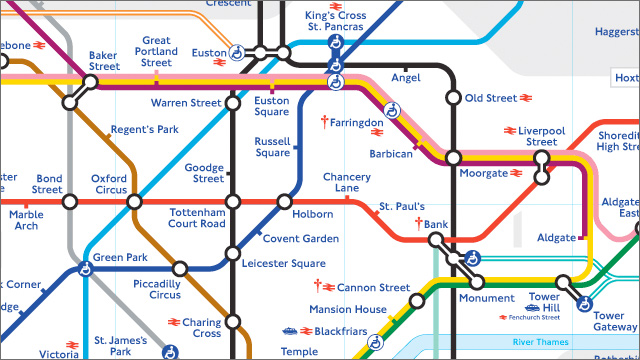

# Tube Stations

## Description
The London Underground, also known as “The Tube”, is one of the world’s busiest metro systems, with 1.1 billion passenger journeys p.a.
Most passengers plan their journeys by consulting the Tube map, which shows the lines and stations of the London Underground metro network. It is not geographically accurate but is world famous for its
elegant angular layout which is similar to that of an electrical circuit diagram.

<p align="center">
  
</p>

Supplied files:
* `map.txt` - simple ASCII Tube map
* `stations.txt` - containing a mapping from the letters and numbers used to denote stations onto full station names
* `lines.txt` - containing a mapping from line symbols to line names

## Objective

### 1
Write function `get_symbol_position(map, height, width, target, r, c)` that, given a symbol character target finds the coordinates (`r`, `c`) of the first occurrence of that symbol on an ASCII map with `height` rows and `width` columns when scanned in a row-by-row fashion. If the symbol is found, the function should return `true` and set the output parameters `r` (the row number) and `c` (the column number), both of which are indexed starting from 0. If the symbol cannot be found, the function should return `false` and `r` and `c` should both be set to `-1`.
For example, the code:
```
int r, c;
bool success = get_symbol_position(map, height, width, ’T’, r, c);
```
should result in `success` having the value `true`, `r` having the value `23` and `c` having the value `21`, since station `'T'` is to be found at map coordinates (23, 21).

Similarly, the code:
```
int r, c;
bool success = get_symbol_position(map, height, width, ’z’, r, c);
```
should result in `success` having the value `false`, `r` having the value `-1` and `c` having the value `-1` (since `'z'` is not on the map).

### 2
Write function `get_symbol_for_station_or_line(name)` which, given the input parameter `name` describing the name of a station or line, returns the corresponding map symbol character. If there is no such station or line, return the space character `' '`.
For example, the code:
```
cout << "The symbol for Victoria station is ’"
<< get_symbol_for_station_or_line("Victoria") << "’";
cout << endl << "The symbol for the District Line is ’"
<< get_symbol_for_station_or_line("District Line")
<< "’" << endl;
```
should result in the output:
```
The symbol for Victoria station is ’T’
The symbol for the District Line is ’>’
```

### 3
Write function `validate_route(map, height, width, start station, route, destination)` that, given the name of an origin station `start_station` and string `route` describing a passenger journey in terms of the direction taken on the ASCII Tube map at each journey step, determines if the route is valid according to the following rules:
* The input parameter `start_station` must be a valid station name (as given in `stations.txt`). If not, return error code `ERROR_START_STATION_INVALID`
* The input parameter route should be a character string describing a sequrence of directions ("N", "S", "W", "E", "NE", "NW", "SE", "SW") separated by commas. So, for example, a valid route string is `"N,E,SW,N,W"`. If a supplied direction is invalid, return `ERROR_INVALID_DIRECTION`
* The passenger journey begins on the ASCII Tube Map at the coordinates of `start_station`, and follows at each journey step the directions given in the `route`, moving one map square at a time. If this route strays outside the bounds of the map, return `ERROR_OUT_OF_BOUNDS`. If the route strays off a station or line/track, return `ERROR_OFF_TRACK`
* Line changes can only take place at stations (since train doors are firmly closed when travelling between stations for safety reasons). If an attempt is made to change lines outside of a station, return `ERROR_LINE_HOPPING_BETWEEN_STATIONS`
* An attempt to retrace a journey step outside of a station is not permitted (since trains travel from station to station without reversing). If an attempt is made to do this, return `ERROR_BACKTRACKING_BETWEEN_STATIONS`
* The endpoint of the passenger journey should be a station. If not, return `ERROR_ROUTE_ENDPOINT_IS_NOT_STATION`

If the route is valid the function should return the number of line changes required to complete the journey as the return value of the function, and assign the output parameter `destination` to be the name of the station at the end of the route. If the route is invalid, the function should return an appropriate error code.

For example, the code:
```
char route[512], destination[512];
strcpy(route, "S,SE,S,S,E,E,E,E,E,E,E,E,E,E,E");
int result = validate_route(map, height, width, "Oxford Circus", route, destination);
```
should result in `result` set to `1` (since this is a valid route and 1 line change is required) and `destination` set to `"Leicester Square"`.