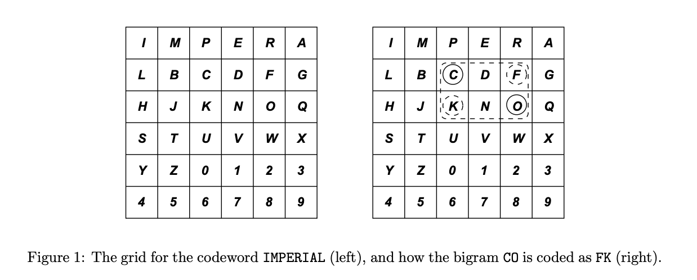

# Playfair Cipher

## Description

The Playfair cipher is an encryption system that was devised in the mid-19th century. A simplified version of this scheme works as follows:

1. A 6 × 6 encoding grid containing the letters of the alphabet A-Z and the digits 0-9 is set up. The order in which these 36 characters appear in the grid is determined by a codeword. The first occurrence of the letters or digits in the codeword appear first, followed by the unused letters and digits in lexical order. The left grid in the figure below shows the encoding grid for the codeword `IMPERIAL`.

<center></center>

2. The message to be encrypted (the plain text) is then split into bigrams (groups of two letters). Spaces and punctuation in the plain text are ignored, and an X is added to the plain text to complete the last pair if necessary. Thus the message `COME TO THE QUEEN’S TOWER AT 7 O’CLOCK.` is divided up into the bigrams `CO ME TO TH EQ UE EN ST OW ER AT 7O CL OC KX`.

3. Each plain text bigram is then encoded into two cipher characters as follows. The first cipher character is the grid character at the intercept of the row of the first bigram character and the column of the second bigram character. The second cipher character is the grid character at the intercept of the column of the first bigram character and the row of the second bigram character. Thus the bigram `CO` is encoded as `FK` (as shown on the right in the figure), and the resulting cipher text for the whole message is: `FKEMWJSJANVPENTSOWREMX8NLCKFQU`.

## Objective

### 1
Write a function `prepare(input,output)` which produces an output string suitable for Playfair encoding from some input string by:
* copying the alphanumerical characters (but not any space or punctuation characters) from the input string to the output string
* making the letters in the output string all uppercase
* adding an ’X’ to the output string if it contains an odd number of characters

The first parameter to the function is a read-only string containing an input sentence. The second parameter is the prepared output sentence.

For example:
```
char prepared[100];
prepare("Come to the Queen’s Tower at 7 o’clock!",prepared); // Output: COMETOTHEQUEENSTOWERAT7OCLOCKX
```

### 2
Write a function `grid(codeword, square)` which produces the 6x6 Playfair square (encoding grid) corresponding to a given code word. The first parameter to the function (`codeword`) is an input string containing a code word (e.g. `IMPERIAL`). You may assume that the code word consists of upper case letters and digits only. The second parameter (`square`) is an output parameter which takes the form of a 2D array of characters representing the encoding grid.

For example thee below should result in the 2D array playfair having the value shown on the left in the figure:
```
char playfair[6][6];
grid("IMPERIAL",playfair);
```

### 3
Write a function `bigram(square, inchar1, inchar2, outchar1, outchar2)` which encodes a single bigram (two letter pair) using a given encoding grid. The parameters are as follows:
* `square` is the encoding grid to be used to encode the bigram
* `inchar1` and `inchar2` are two character input parameters making up the bigram to be encoded
* `outchar1` and `outchar2` are two character output (reference) parameters representing the encoded bigram

For example, the code should result in `out1` and `out2` having the values `F` and `K` respectively:
```
char playfair[6][6];
grid("IMPERIAL",playfair);
char out1, out2;
bigram(playfair,’C’,’O’,out1,out2);
```

### 4
Write a function `encode(square, prepared, encoded)` which encodes a prepared input string using a given encoding grid. The parameters are as follows:
* `square` is the encoding grid to be used
* `prepared` is the prepared input string containing an even number of upper case letters and/or digits
* `encoded` is an output parameter containing the encoded sentence

For example, the code should result in the string `encoded` having the value `FKEMWJSJANVPENTSOWREMX8NLCKFQU`:
```
char playfair[6][6];
grid("IMPERIAL",playfair);
char encoded[100];
encode(playfair,"COMETOTHEQUEENSTOWERAT7OCLOCKX",encoded);
```